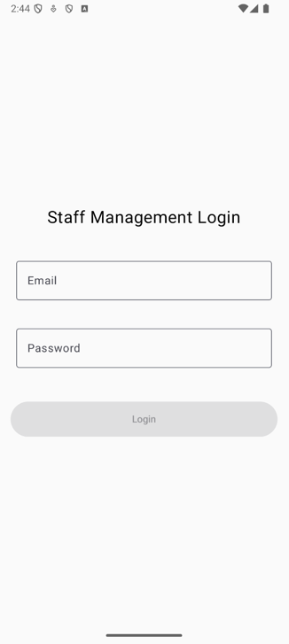
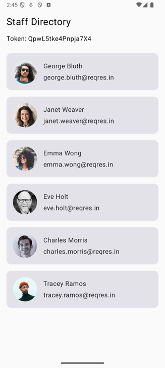

# Staff Management App

This is a **Kotlin-based Android application**. The app allows employees to securely log in and view a list of staff members.

---

## Features Implemented

### 1. **Login Page**
- **Email and Password Input**:
    - Simple UI with input fields for email and password.
    - Password input is masked for security.
- **Validation**:
    - Email format validation.
    - Password validation: Must be 6-10 alphanumeric characters.
- **Navigation**:
    - Redirects to the **Staff Directory Page** upon successful login.
- **Error Handling**:
    - Displays error messages for invalid credentials or network issues.

### 2. **Staff Directory Page**
- **Token Display**:
    - Displays the login token at the top of the page.
- **Staff List**:
    - Fetches and displays a list of staff members from the API.
    - Each staff item includes: avatar, first name, last name, and email.
    - Only displays the first page of staff data.
- **Error Handling**:
    - Displays error messages in case of API or network errors.

---

## What Has Been Done
- **Functional Features**:
    - The login and staff directory pages have been implemented as per the requirements.
    - Email and password validation are in place.
    - Network requests for login and fetching staff data are functional.
    - Loading indicators and error messages enhance user experience.
- **Architecture**:
    - The app uses the **MVVM architecture** for separation of concerns.
- **UI**:
    - Built with **Jetpack Compose**, providing a modern and declarative UI framework.
- **Testing**:
    - Implemented unit tests for the `LoginViewModel` to validate email and password checks.

---

## Screenshots

### **Login Page**

### **Staff Directory Page**

